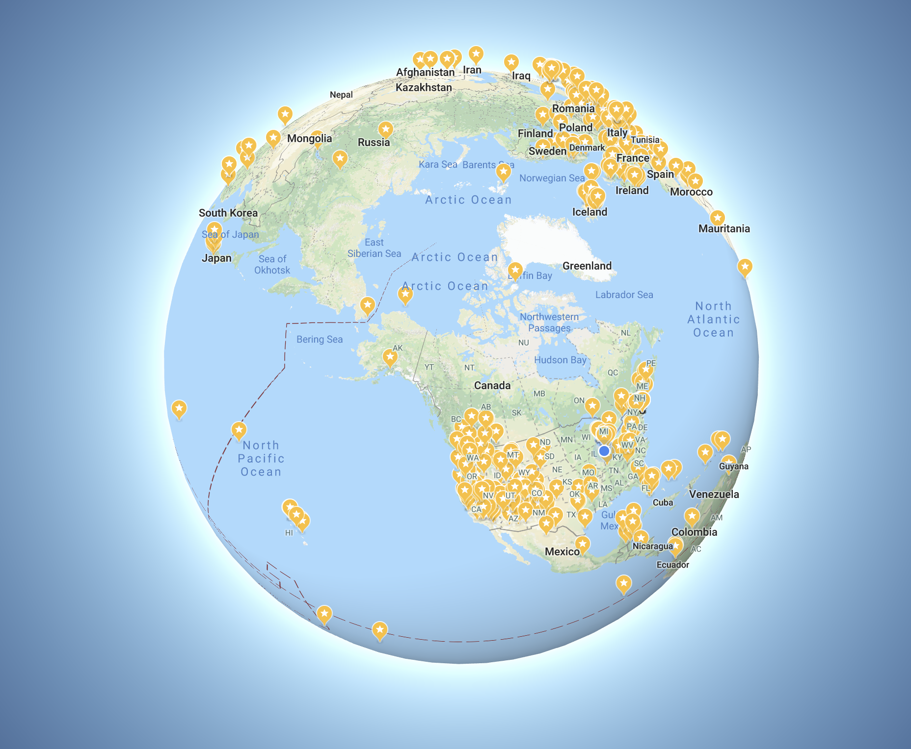

Hello there!

Hemanth here, currently in my final semester pursuing a Masters degree at Purdue University. My thesis is on Forced attention for Image Captioning, and will be defending it soon. I've had professional software developement experience of ~5 years, though I've been programming for longer. 

I also hold an assistantship at Purdue University, with their Center for Career Opportunities Office, as a programmer.

I've also participated in various competitions, with the notable ones being:
+ IBM's The Great Mind Challenge - placed 5th in India for building an employee performance management app.
+ Microsoft's Imagine Cup - placed 2nd in India for building an app and cloud service for finding blood donors in realtime.
+ Amazon's Startup Weekend - runners up for building an AI chatbot for customer service.

I like writing bots for discord, or write software enhanced with AI. When I'm not working on my thesis, or hobby programming, I'd rather read or play games.

You can find my resume [here](/pdf/resume_short_software.pdf).

#### There are a few things I want to do :

Though I haven't travelled much, that is one thing I'm trying to rectify. I've got a huge, growing list of places marked!

<figure>
    
	<figcaption>
		500+ places, and counting!
	</figcaption>
</figure>

Oh, I'm also learning to draw! At least, try to. I will put up things I've drawn soon.

Blog was built using <a href="https://www.gatsbyjs.org/" target="_blank">gatsbyjs</a> and a modified <a href="https://github.com/alxshelepenok/gatsby-starter-lumen" target="_blank">lumen theme</a>.